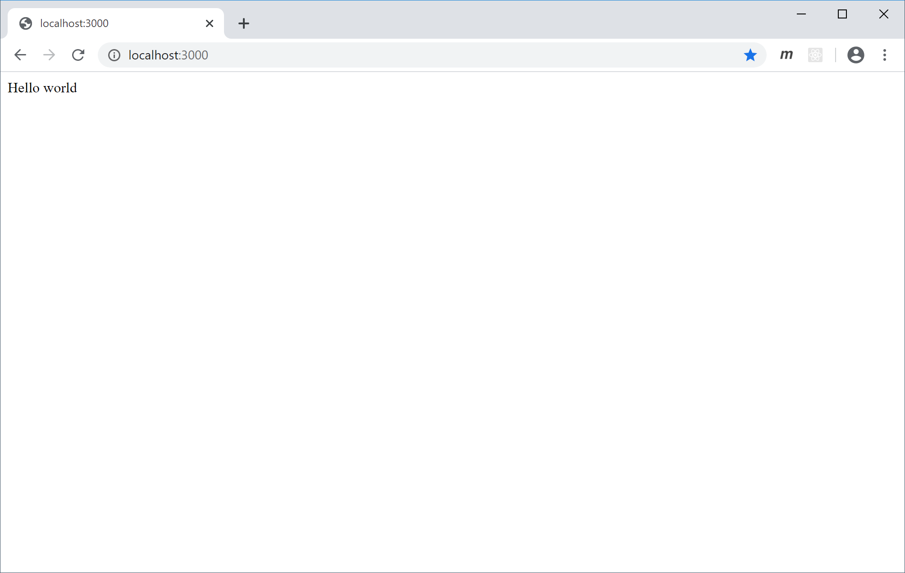
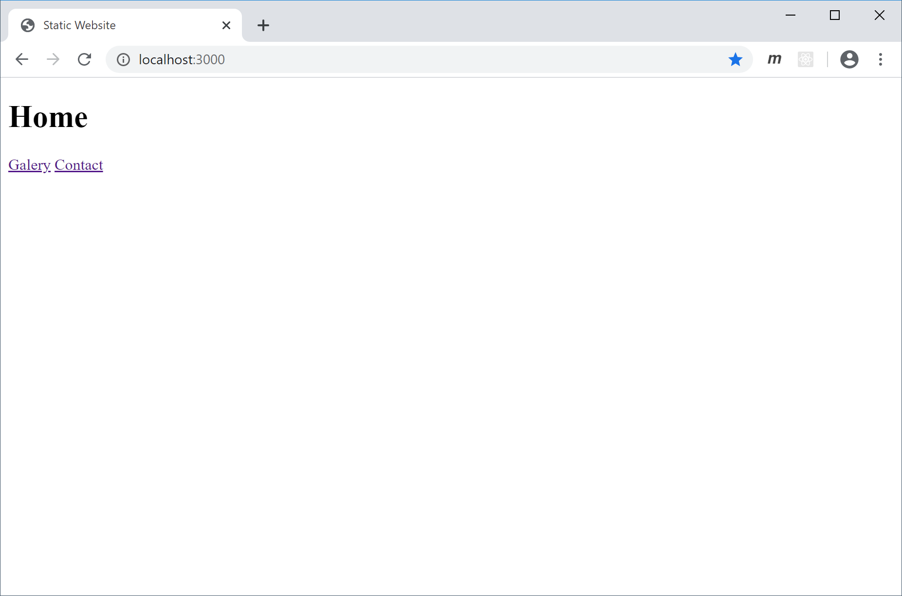
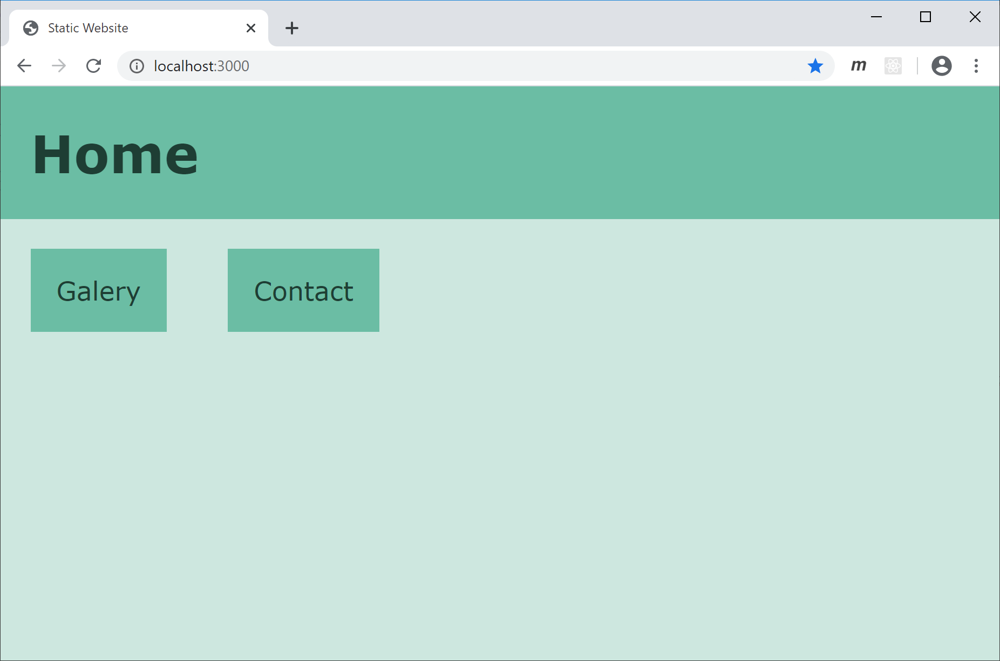
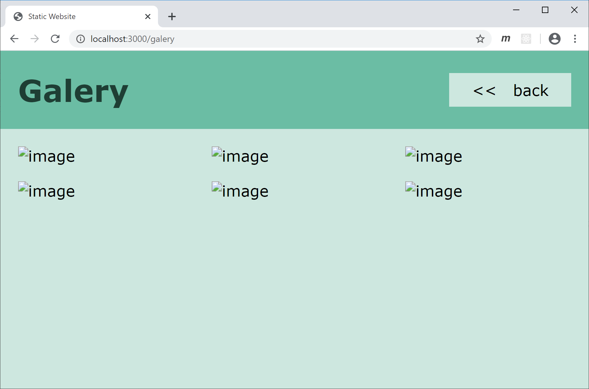
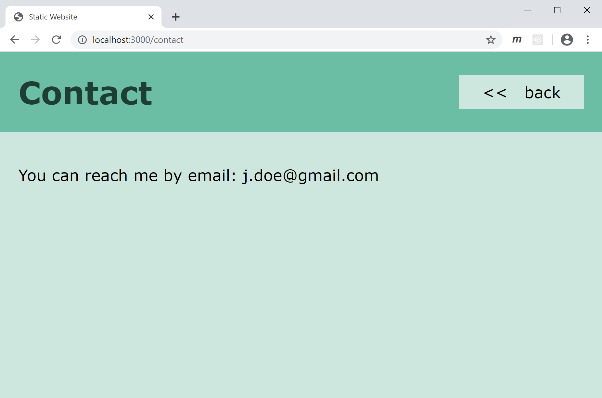
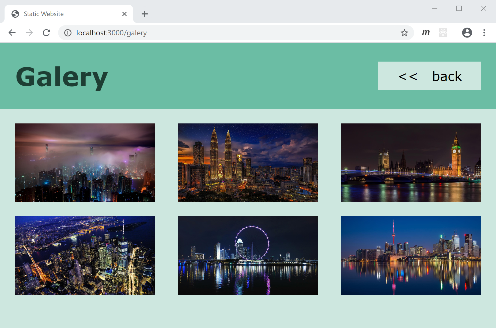

# Static Webserver

## Task 1: Setup project

Erledigen Sie folgende Schritte um das Express-Projekt aufzusetzen:

- `package.json` aus Demobeispiel im *Course Material* kopieren
- Packages installieren
- `tsconfig.json` aus Demobeispiel im *Course Material* kopieren
- `.gitignore` mit folgenden Einträgen erstellen
  - `node_modules`
  - `app.js`

## Task 2: Serve "Hello world"

Implementieren Sie in der Datei `app.ts` mithilfe von Express einen Webserver, der bei einem GET Request am Port 3000 mit dem Text `'Hello world'` antwortet.

**Wichtig:** Kopieren Sie `app.ts` nicht einfach aus dem Demobeispiel im *Course Material*. Tippen Sie den Code stattdessen ab und versuchen Sie dabei jede Codezeile zu verstehen.

## Task 3: Serve index.html

Passen Sie den Endpunkt an, sodass statt `'Hello world'` der Inhalt der Datei `public/index.html` zurückgesendet wird.

## Task 4: Serve style.css

Beim Rendering der `index.html` fragt der Webbrowser (derzeit noch erfolglos) beim Server um ein Stylesheet an. Erstellen Sie daher einen Endpunkt,  der GET Requests an  `/css/style.css` mit dem Inhalt der Datei `public/css/style.css` beantwortet.

## Task 5: Serve galery.html and contact.html

Erstellen Sie zwei Endpunkte, die GET Requests an  `/galery` bzw. `/contact` mit dem Inhalt der entsprechenden HTML-Datei beantworten.

**Anmerkung:** Die Bilder der Galerie werden im Rahmen der nächsten Aufgabe vom Webserver bereitgestellt.

## Task 6: Serve images

Erstellen Sie einen Endpunkt, der beispielsweise GET Requests an  `/img/hongkong.jpg` mit dem entsprechenden Bild beantwortet.

**Tipp:** Sie müssen nicht für jedes Bild eine eigenen Endpunkt implementieren. Verwenden Sie stattdessen einen Request Parameter, um auf den Namen des angefragten Bilds zugreifen zu können.

